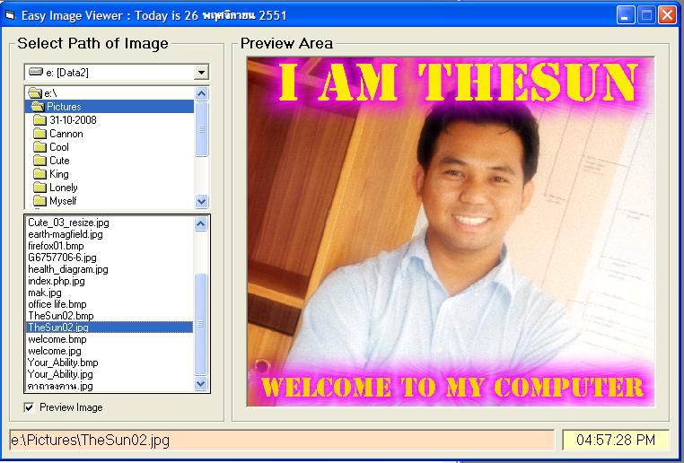



## Easy Image Viewer

### Description

This is an easy image viewer that use only 4 controls in the project. By the way, we use the stretch function of the image control.
 
### More Info
 

             |
---                |---
**Submitted On**   |2008-11-04 11:47:28
**By**             |[RaChanR](https://github.com/Planet-Source-Code/PSCIndex/blob/master/ByAuthor/rachanr.md)
**Level**          |Beginner
**User Rating**    |5.0 (10 globes from 2 users)
**Compatibility**  |VB 5\.0, VB 6\.0
**Category**       |[Graphics](https://github.com/Planet-Source-Code/PSCIndex/blob/master/ByCategory/graphics__1-46.md)
**World**          |[Visual Basic](https://github.com/Planet-Source-Code/PSCIndex/blob/master/ByWorld/visual-basic.md)
**Archive File**   |[Easy\_Image21354211262008\.zip](https://github.com/Planet-Source-Code/rachanr-easy-image-viewer__1-71448/archive/master.zip)

